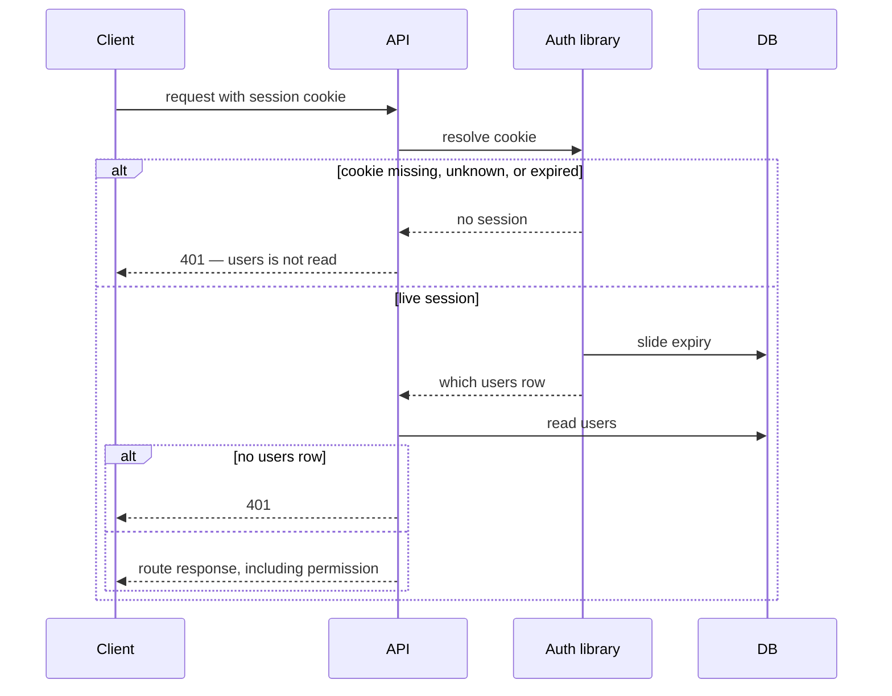

# Authentication

> Plan from this document. Each slice below carries its own shape — copy it, do not re-derive it.
> Status: confirmed by the user, 2026-09-26

## Situation

- Project: in active construction
- Decision: committed by the user, 2026-09-26, in this conversation. The same day the user chose Better Auth's behavior where the spike failed: the activation token is a JWT that contains the email and is not stored; a new email does not kill the previous token; a used token returns success; there is no three-session cap; a password change keeps the current session and deletes the others after the password write.
- In flight: email-and-password signup, the activation link, and the session cookie are the behavior this keeps. Social login, passkeys, two-factor, and new permission rules stay out.
- At stake: one-way. The current password hash is peppered, so another system cannot check it, and this work drops that hash.

## Problem

Signup, login, and account verification were promised so this team is not the reviewer of password hashing, session cookies, and verification tokens. Without that handoff, the next finance feature will call the current session check and more peppered hashes will accumulate, and the cut becomes a password reset for real accounts. Now, because the only accounts are test and localhost — the user, 2026-09-26 — so no real account has to keep the current hash.

## Success

- Worked if: this API no longer stores a password hash, a session token, or a verification token, and a new account cannot log in until the activation link is used, then receives a 30-day sliding session and `create:session:own`.
- Going wrong: the activation link stops being `WEBAPP_URL/register/activate?token=…`, or `GET /api/v1/user` stops returning `permission`.
- Review: whoever creates the first non-test account checks that flow once.

## Boundary

In: signup, the password, the session cookie, email verification, and a forward migration that drops the old credential data.

Out: social login, passkeys, and two-factor — the user kept them out of this round. New permission rules — the catalog stays as it is.

Unchanged: `users.username` and `users.email` stay required and unique. `users.permission` stays `action:resource:modifier`. `GET /api/v1/user` still returns `username`, `email`, and `permission`. The activation email copy stays as it is.

## Shape

An embedded library in this Postgres holds credentials and sessions, and `users` stays the product record this API reads for `permission`. A protected call is refused before `users` is read when the session cookie is missing or dead. Swapping that library later costs a password reset for every account. A hosted login product wins only if the user record should live outside this database.

## Key decisions

1. **The password and the session belong to Better Auth in this Postgres. The verification token is a signed JWT and is not a row. `users.username`, `users.email`, and `users.permission` belong to this API.** The cookie in the browser is only the id used to look the session up. Outside production its name is `better-auth.session_token`. When `NODE_ENV` is `production`, or `baseURL` is `https`, Better Auth 1.7.6 prefixes that name with `__Secure-` and sets `Secure`. `SameSite` is not decided here.

2. **Login is refused until the account is activated, and a successful activation sets `permission` to `create:session:own`.** A correct password on an unactivated account and a wrong password both return 401 with no cookie. The library records the account verified before `permission` is written. Those two writes are not one commit.

3. **The session cookie alone identifies the session. It lasts 30 days and slides on each authenticated request. There is no cap on live sessions.** A fourth login leaves the older cookies valid. The user agent is not compared. Better Auth 1.7.6's default `session.updateAge` is 86400 seconds, which does not slide on every request. This outcome needs `session.updateAge` of `0` and `session.expiresIn` of `2592000`.

4. **Logout deletes only the current session. Changing the password keeps the session that sent the change and deletes the other sessions for that user after the new password is stored.** Those deletes are not the same commit as the password. Better Auth 1.7.6's `revokeOtherSessions` flag deletes every session for that user, including the current one, then creates a new session and a new cookie. This outcome does not use that flag.

5. **The activation link is `WEBAPP_URL/register/activate?token=…` and lasts 15 minutes. The token's payload contains the email and does not contain the username.** An expired or unknown token fails and leaves `permission` unchanged. A token for an already activated account returns the activation success body and leaves `permission` unchanged. Requesting a new email does not kill the previous token.

6. **One forward migration drops `users.password`, drops `session`, and drops `user_activation_tokens`.** It runs in the release that stops reading them. It is safe in production because no real account depends on those hashes. `username`, `email`, and `permission` remain.

7. **The existing routes stay the caller contract. The library sits behind them.** `POST /api/v1/user`, `PATCH /api/v1/user/activate`, `POST /api/v1/session/login`, `DELETE /api/v1/session/logout`, `GET /api/v1/user`, and `PUT /api/v1/user/:username`. A library's own default mount would break the webapp that already calls these.

## Work

| Slice                         | Delivers                                                                                                      | Status                |
| ----------------------------- | ------------------------------------------------------------------------------------------------------------- | --------------------- |
| [Auth library](#auth-library) | Better Auth in this Postgres, behind the routes in Key decision 7. The verification token is a JWT, not a row | chosen                |
| [Signup](#signup)             | An account that cannot log in, and an activation email                                                        | clear                 |
| [Activation](#activation)     | `create:session:own` after a live link, and a new email that leaves the previous token valid                  | clear — default taken |
| [Session](#session)           | Login, the request check, logout, and password-change revocation of the other sessions                        | clear — default taken |
| [users](#users)               | `users` without a password hash, and no `user_activation_tokens` table                                        | clear                 |

Order: Auth library → Signup → Activation → Session → users.

Already handled by existing code: a duplicate `username` or `email` on signup is 422, as `users` does today. `GET /api/v1/user/:username` still requires a live session.

Derivable from the repository, left to the plan: error bodies, ISO dates, and never returning `password` — all as `users` does them.

### Auth library

**Delivers** Better Auth behind Key decision 7. The password and the session are rows in this Postgres. The verification token is a signed JWT and is not a row. **Status: chosen.** This is the door. Swapping it later costs a password reset.

Checked 2026-09-26 against Better Auth 1.7.6 in this repo, its docs, and `email-verification.mjs`. The JWT claims held: the token is `signJWT` of `{ email }` lowercased, it is not stored, a second email does not invalidate the first, and an already verified account returns success. Three defaults did not match Key decisions 1, 3, and 4: the production cookie prefix, `session.updateAge`, and `revokeOtherSessions`. Those decisions name the outcome; the settings that produce it are in the task. With `requireEmailVerification`, `signUpEmail` answers a duplicate email with a synthetic success and stores nothing. The route still returns 422. The package is ESM-only. This API emits CommonJS. `username` and `permission` stay on `users`. The library is called from the existing routes, on the `pg` pool already in this process. It is not mounted at its own path.

### Signup

**Delivers** an account that exists immediately and cannot log in, plus the activation email. **Status: clear.**

| State                          | What should happen                                                                                                     | Caller sees                                |
| ------------------------------ | ---------------------------------------------------------------------------------------------------------------------- | ------------------------------------------ |
| New signup                     | `users` row is stored with an empty `permission`. The library stores the password and sends the email. Key decision 5. | 201 `{ username, created_at, updated_at }` |
| Username or email already used | Nothing is stored and no email is sent.                                                                                | 422                                        |

`POST /api/v1/user` `{ username, email, password }` → `201` `{ username, created_at, updated_at }`

### Activation

**Delivers** `create:session:own` for a live link, and a new link that leaves the previous token valid. **Status: clear — default taken.**

| State                                       | What should happen                                                                                         | Caller sees                                      |
| ------------------------------------------- | ---------------------------------------------------------------------------------------------------------- | ------------------------------------------------ |
| Unused, unexpired token                     | `permission` becomes `create:session:own`. The library records the account verified first. Key decision 2. | 200 `{ message: "User activated successfully" }` |
| Token for an already activated account      | `permission` is unchanged. Key decision 5.                                                                 | 200 `{ message: "User activated successfully" }` |
| Expired or unknown token                    | `permission` is unchanged.                                                                                 | 404                                              |
| New email for an unactivated account        | The previous token stays valid. A new link is sent. Key decision 5.                                        | 200 with the same body as an unknown email       |
| Unknown email, or account already activated | No email. `permission` unchanged.                                                                          | 200 with that same body                          |

`PATCH /api/v1/user/activate?token=` → `200` `{ message: "User activated successfully" }`

Default taken:

1. How a new email is requested — `POST /api/v1/user/activate` `{ email }` returns 200 `{ message: "If an unactivated account exists for that email, a new link was sent." }` whether or not the email matches an unactivated account.

### Session

**Delivers** a cookie session that login creates, every protected request checks, logout ends one of, and a password change ends the others. **Status: clear — default taken.**

| State                                  | What should happen                                                                                                                          | Caller sees                                                                     |
| -------------------------------------- | ------------------------------------------------------------------------------------------------------------------------------------------- | ------------------------------------------------------------------------------- |
| Login, activated, password matches     | A session is created and the cookie is set. Key decision 3.                                                                                 | 200 and `Set-Cookie`                                                            |
| Login, password does not match         | No session.                                                                                                                                 | 401, no cookie                                                                  |
| Login, password matches, not activated | No session. Key decision 2.                                                                                                                 | 401, no cookie                                                                  |
| Fourth live login                      | A fourth session is created. The older cookies stay valid. Key decision 3.                                                                  | 200 and `Set-Cookie`. The oldest cookie's next request is the route's response. |
| Request with a live cookie             | Expiry slides 30 days. `users` is loaded. The route runs.                                                                                   | The route's response. `GET /api/v1/user` is below.                              |
| Cookie missing, unknown, or expired    | `users` is not read.                                                                                                                        | 401                                                                             |
| Session resolves, `users` row is gone  | The session is dead.                                                                                                                        | 401                                                                             |
| Logout with a live cookie              | That session is deleted. Other sessions stay. Key decision 4.                                                                               | 200, cookie cleared                                                             |
| Logout without a live cookie           | Nothing is deleted.                                                                                                                         | 401                                                                             |
| Password changed                       | The new password is stored. The session that sent the change stays. The other sessions for that user are deleted afterward. Key decision 4. | 200 `{ username, email, updated_at }`                                           |

`POST /api/v1/session/login` `{ email, password }` → `200` and `Set-Cookie`

`DELETE /api/v1/session/logout` → `200`

`GET /api/v1/user` → `200` `{ session: { updated_at, expires_at }, user: { username, email, permission, updated_at } }`

`PUT /api/v1/user/:username` `{ password }` → `200` `{ username, email, updated_at }`

Default taken:

1. Login body — `200` sets the cookie and does not include the session token. The cookie is the credential.

### users

**Delivers** a `users` table with no password hash, and the removal of the tables the library replaces. **Status: clear.**

| Database after the migration                                      | What remains                                                                    |
| ----------------------------------------------------------------- | ------------------------------------------------------------------------------- |
| Test and localhost rows, and an empty production credential store | `username`, `email`, `permission`, and timestamps on `users`. No password hash. |

Table `users`; `users.password` removed. `user_activation_tokens` dropped. The library's `session` and `account` tables replace the old `session` table. Key decision 6. `users` is the library's user table. The library's `name` is the existing `username` column. The migration adds the verified flag the library writes before `permission`. That flag is not in `GET /api/v1/user`.
