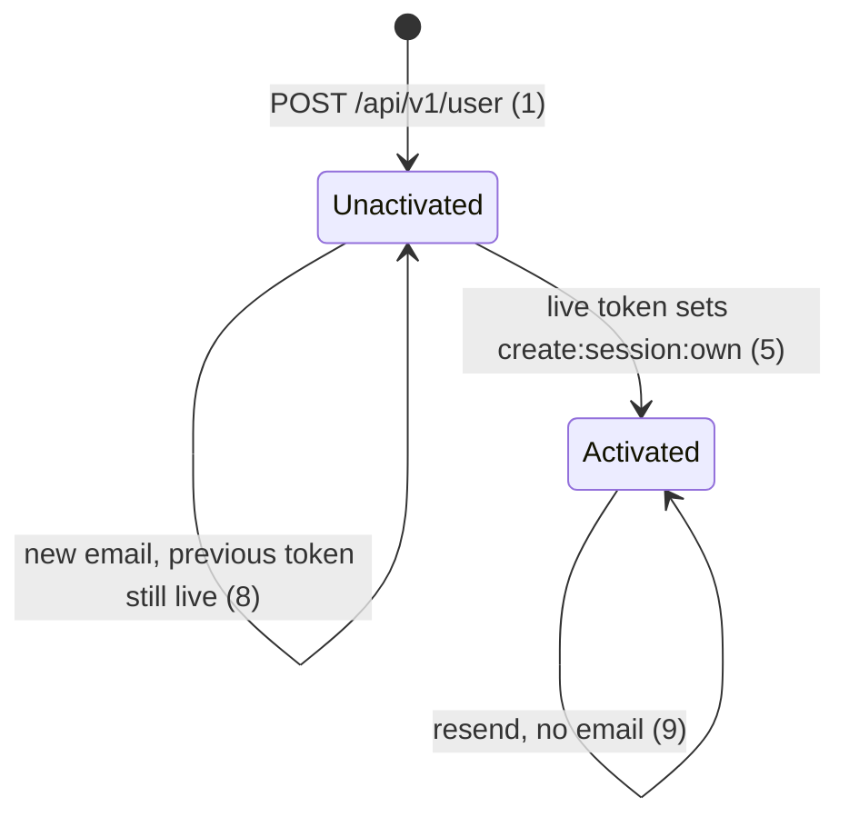
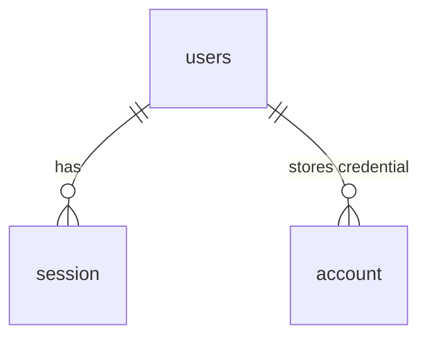

# Authentication

> Build this with **tlc-implement** (`.cursor/skills/tlc-implement/SKILL.md`).
> Every criterion below becomes a check with a proof, referenced by its number. Nothing under
> `Unresolved` gets settled while building.

## Intent

This API stores a peppered bcrypt hash on `users.password`, a session token in `session`, and an activation token in `user_activation_tokens`, and this team reviews that code. The next finance feature will call the current session check, and more peppered hashes will accumulate. The only accounts are test and localhost — the user, 2026-09-26 — so no real account has to keep the current hash.

A new account still cannot log in until it opens `WEBAPP_URL/register/activate?token=…`. After that it receives `create:session:own` and a 30-day sliding cookie. Login answers `200` with that cookie and does not return the token. The hash, the session, and the activation token are no longer rows this API owns.

23 criteria in 5 slices · 4 one-way doors · 4 open, of which 1 blocks go-live

## Criteria

### Signup

1. When `POST /api/v1/user` is called with `{ username, email, password }` for a username and email that are not already stored, then the response is `201` `{ username, created_at, updated_at }`, `created_at` and `updated_at` match `YYYY-MM-DDTHH:mm:ss.sssZ`, the body has no `password`, `email`, `id`, or `permission`, the response has no `Set-Cookie`, the stored `users.permission` is `[]`, and the stored `users.email` is the submitted email lowercased.
2. When `POST /api/v1/session/login` is then called with that email and password, then the response is `401` `{ name: "unauthorized", message: "User Unauthorized to do this operation.", action: "Please try to login again or if you're facing any issue contact the support team.", status_code: 401 }` and it has no `Set-Cookie`.
3. When that signup is called, then one email is sent with subject `Ative a sua conta na Buzzy Finance` and text `Olá <username>,\n\nPor favor, ative a sua conta clicando no seguinte link:\n\n<link>\n\n Nos vemos logo. Muito Obrigado!`, the link is `WEBAPP_URL/register/activate?token=<token>` with the token percent-encoded, the token payload's `email` is the signup email lowercased, the payload does not contain the username, and the token's `exp` is within 2 seconds of `iat` + 900.
4. When `POST /api/v1/user` is called with a username or email that is already stored, compared case-insensitively, then the response is `422` `{ name: "validation_error", message: "These fields are not valid: <fields>", action: "Fix the provided fields and try again.", status_code: 422 }`, `<fields>` is `email`, `username`, or `email,username` for the duplicates, no new `users` row is stored, and no email is sent.

### Activation

5. When `PATCH /api/v1/user/activate?token=` is called with an unexpired token for an account whose `permission` is `[]`, then the response is `200` `{ message: "User activated successfully" }`, it has no `Set-Cookie`, and `users.permission` is `["create:session:own"]`.
6. When `PATCH /api/v1/user/activate?token=` is called with a token for an account that already has `permission` `["create:session:own"]`, then the response is `200` `{ message: "User activated successfully" }` and `permission` is unchanged.
7. When `PATCH /api/v1/user/activate?token=` is called with a token whose `exp` is in the past, with a token that is not a verification JWT, or with the query param absent, then the response is `404` `{ name: "not_found_error", message: "Activation token not found or expired", action: "Please request a new activation token.", status_code: 404 }` and `permission` is unchanged.
8. When `POST /api/v1/user/activate` is called with `{ email }` for an account whose `permission` is `[]`, then the response is `200` `{ message: "If an unactivated account exists for that email, a new link was sent." }`, a new email of the shape in criterion 3 is sent, and the previous unexpired token still produces criterion 5.
9. When `POST /api/v1/user/activate` is called with `{ email }` for an unknown email or for an account whose `permission` is `["create:session:own"]`, then the response is `200` `{ message: "If an unactivated account exists for that email, a new link was sent." }`, no email is sent, and `permission` is unchanged.

### Session

10. When `POST /api/v1/session/login` is called with the email and password of an account whose `permission` is `["create:session:own"]`, and the server's `NODE_ENV` is `local` and `BASE_URL` is `http://localhost:8080`, then the response is `200` `{}`, the body has no `session_token` and no `password`, and `Set-Cookie` is `better-auth.session_token` with `HttpOnly`, `Path=/`, and `Max-Age=2592000`, and the `Secure` attribute is absent.
11. When `POST /api/v1/session/login` is called with a password that does not match, then the response is the `401` body in criterion 2 and it has no `Set-Cookie`.
12. When a fourth `POST /api/v1/session/login` succeeds for an account that already has three live sessions, then that response is `200` with `Set-Cookie`, and a `GET /api/v1/user` with the oldest session's cookie is `200`.
13. When `GET /api/v1/user` is called with a live cookie, then the response is `200` `{ session: { updated_at, expires_at }, user: { username, email, permission, updated_at } }`, every timestamp matches `YYYY-MM-DDTHH:mm:ss.sssZ`, the body has no `password`, `permission` is the stored array, `expires_at` is within 60 seconds of 30 days after the response, the response sets `better-auth.session_token` again, and a second call returns an `expires_at` later than the first.
14. When `GET /api/v1/user` is called with no cookie, an unknown cookie, or a cookie whose session is past `expires_at`, then the response is the `401` body in criterion 2.
15. When the `users` row for a live session has been deleted, then a request with that session's cookie is the `401` body in criterion 2.
16. Always, a live cookie is accepted on `GET /api/v1/user` when the `User-Agent` differs from the one sent at login and when the header is absent. The response is `200`.
17. When `DELETE /api/v1/session/logout` is called with a live cookie, then the response is `200`, `Set-Cookie` sets `better-auth.session_token` with `Max-Age=0`, a later request with that cookie is the `401` body in criterion 2, and a different session's cookie still receives `200` from `GET /api/v1/user`.
18. When `DELETE /api/v1/session/logout` is called without a live cookie, then the response is the `401` body in criterion 2 and every session that existed before the call still receives `200` from `GET /api/v1/user`.
19. When `PUT /api/v1/user/:username` is called with `{ password }` and a live cookie, then the response is `200` `{ username, email, updated_at }` with `updated_at` matching `YYYY-MM-DDTHH:mm:ss.sssZ` and no `password` in the body, login with the new password is criterion 10, login with the old password is criterion 11, that same cookie still receives `200` from `GET /api/v1/user`, and a different session's cookie receives the `401` body in criterion 2.
20. When `PUT /api/v1/user/:username` is called with `{ username }` or `{ email }` and no `password`, then the response is `200` `{ username, email, updated_at }` with `updated_at` matching `YYYY-MM-DDTHH:mm:ss.sssZ` and no `password` in the body, the returned `email` is the email stored after the call, no email is sent, and every session that existed before the call still receives `200` from `GET /api/v1/user`.
21. When `GET /api/v1/user/:username` is called without a live cookie, then the response is the `401` body in criterion 2. When it is called with a live cookie, then the response is `200` `{ username, email, permission, created_at, updated_at }`, the timestamps match `YYYY-MM-DDTHH:mm:ss.sssZ`, and the body has no `password`.

### users

22. After the forward migration, `users` has `username`, `email`, and `permission`, `users` has no `password` column, `user_activation_tokens` does not exist, a password verifier stored for a new account is neither the plaintext password nor `<password>.<APP_SECRET>`, and login with the password of a `users` row that existed before the migration is the `401` body in criterion 2.

### Auth library

23. When the API is started with `node dist/app/api/server.js` after `pnpm build`, the signup in criterion 1 returns `201`.

## States

## Out of scope

- Social login, passkeys, and two-factor — the user kept them out of this round.
- New permission rules — the catalog stays `action:resource:modifier`.
- A cap of three sessions — the user dropped it when choosing this library.
- Deleting the current session in the same commit as a password change — the user kept the current session, and the other deletes happen after the password write.
- Mounting the library at its own path — the webapp already calls the routes in the Surface table.
- A forgot-password mail — this round does not add one.

## Observable

| Surface                             | Decision                            | Landing                                             |
| ----------------------------------- | ----------------------------------- | --------------------------------------------------- |
| API `POST /api/v1/user`             | response shape                      | 1                                                   |
| API `POST /api/v1/user`             | error shape and codes               | 4, Unresolved 4                                     |
| API `POST /api/v1/user`             | who may call it                     | n/a — signup is public                              |
| API `POST /api/v1/user`             | versioning                          | n/a — the path stays `/api/v1/user`                 |
| API `POST /api/v1/user`             | rate limit                          | existing — these routes do not return 429           |
| API `PATCH /api/v1/user/activate`   | response shape                      | 5, 6                                                |
| API `PATCH /api/v1/user/activate`   | error shape and codes               | 7                                                   |
| API `PATCH /api/v1/user/activate`   | who may call it                     | n/a — the link is public                            |
| API `PATCH /api/v1/user/activate`   | versioning                          | n/a — the path stays `/api/v1/user/activate`        |
| API `PATCH /api/v1/user/activate`   | rate limit                          | existing — these routes do not return 429           |
| API `POST /api/v1/user/activate`    | response shape                      | 8, 9                                                |
| API `POST /api/v1/user/activate`    | error shape and codes               | n/a — unknown and activated emails are the same 200 |
| API `POST /api/v1/user/activate`    | who may call it                     | n/a — the request is public                         |
| API `POST /api/v1/user/activate`    | versioning                          | n/a — the path stays `/api/v1/user/activate`        |
| API `POST /api/v1/user/activate`    | rate limit                          | existing — these routes do not return 429           |
| API `POST /api/v1/session/login`    | response shape                      | 2, 10, 11                                           |
| API `POST /api/v1/session/login`    | error shape and codes               | 2, 11                                               |
| API `POST /api/v1/session/login`    | who may call it                     | n/a — login is public                               |
| API `POST /api/v1/session/login`    | versioning                          | n/a — the path stays `/api/v1/session/login`        |
| API `POST /api/v1/session/login`    | rate limit                          | existing — these routes do not return 429           |
| API `DELETE /api/v1/session/logout` | response shape                      | 17, 18                                              |
| API `DELETE /api/v1/session/logout` | error shape and codes               | 18                                                  |
| API `DELETE /api/v1/session/logout` | who may call it                     | 17, 18                                              |
| API `DELETE /api/v1/session/logout` | versioning                          | n/a — the path stays `/api/v1/session/logout`       |
| API `DELETE /api/v1/session/logout` | rate limit                          | existing — these routes do not return 429           |
| API `GET /api/v1/user`              | response shape                      | 13                                                  |
| API `GET /api/v1/user`              | error shape and codes               | 14, 15                                              |
| API `GET /api/v1/user`              | who may call it                     | 14                                                  |
| API `GET /api/v1/user`              | empty state                         | n/a — one session, not a collection                 |
| API `GET /api/v1/user`              | versioning                          | n/a — the path stays `/api/v1/user`                 |
| API `GET /api/v1/user`              | rate limit                          | existing — these routes do not return 429           |
| API `GET /api/v1/user/:username`    | response shape                      | 21                                                  |
| API `GET /api/v1/user/:username`    | error shape and codes               | 21                                                  |
| API `GET /api/v1/user/:username`    | who may call it                     | 21                                                  |
| API `GET /api/v1/user/:username`    | versioning                          | n/a — the path stays `/api/v1/user/:username`       |
| API `GET /api/v1/user/:username`    | rate limit                          | existing — these routes do not return 429           |
| API `PUT /api/v1/user/:username`    | response shape                      | 19, 20                                              |
| API `PUT /api/v1/user/:username`    | error shape and codes               | existing — an unknown username is `NotFoundError`   |
| API `PUT /api/v1/user/:username`    | who may call it                     | existing — the handler does not require a session   |
| API `PUT /api/v1/user/:username`    | versioning                          | n/a — the path stays `/api/v1/user/:username`       |
| API `PUT /api/v1/user/:username`    | rate limit                          | existing — these routes do not return 429           |
| session cookie                      | `SameSite`                          | Unresolved 2                                        |
| email activation copy               | structure                           | 3                                                   |
| email activation copy               | tone                                | 3                                                   |
| email activation copy               | depth                               | 3                                                   |
| email activation copy               | what the reader does next           | 5                                                   |
| screen                              | empty, loading, error, unauthorised | n/a — this API has no screen                        |
| command                             | flags, exit codes                   | n/a — no command                                    |
| collection                          | grouping, duplicates                | n/a — no collection                                 |

## Swept

- validation: 4. A password shorter than 8 characters or longer than 128 is Unresolved 4. The library's minimum of 8 is the length `user1234` already has.
- failure modes: n/a — verification is recorded before `permission` is written, and the other sessions are deleted after the password is stored. This round does not require those pairs to share a commit, and it does not add a repair.
- idempotency and retry: 6, 8, 9
- authorization: 14, 17, 18, 21. `PUT /api/v1/user/:username` does not gain a session requirement. What a password change does to sessions when the request has no cookie is Unresolved 3.
- concurrency and ordering: existing — `users.username` and `users.email` are unique, so one of two simultaneous inserts with the same value is rejected by Postgres. Criterion 12 is four sessions coexisting, not two requests racing one insert.
- data lifecycle: 22
- external-dependency failure: existing — a thrown send becomes `503` `{ name: "service_unavailable_error", message: "The SMTPMailer is not available for connection right now.", action: "Notify the support team and try again later.", status_code: 503 }`
- state transitions: 1, 5, 6, 7, 8, 9
- observability: n/a — no new log line or metric. The pino logger stays as it is.

## Impact

| Front       | What changes                                                                                                                                                                                                                                                          |
| ----------- | --------------------------------------------------------------------------------------------------------------------------------------------------------------------------------------------------------------------------------------------------------------------- |
| domain      | existing term: signup `permission` meant `["read:token:own"]`, now `[]` until activation — activation tests, and any client that treats `read:token:own` as the grant before the link                                                                                 |
| domain      | existing term: the session cookie meant `sdi` holding the raw token, `SameSite=Strict`, and `Secure` always, now `better-auth.session_token` — `app/tests/v1/api/session/session.test.ts`, and any client that sends `Cookie: sdi`                                    |
| domain      | existing term: login `200` meant `{ session_token }`, now `{}` — `parseLoginBody` and the session tests                                                                                                                                                               |
| domain      | existing term: the activation token meant a uuid row in `user_activation_tokens`, and a used token was `404`, now a JWT whose payload contains the email, and a used token is `200` — activation tests that read that table or replay the token                       |
| domain      | existing term: a live session required the same `User-Agent` it was created with, and a missing `User-Agent` was `401`, now the agent is not compared — `FIND_ONE_VALID_SESSION_BY_TOKEN_STATEMENT` and `authManager.getUserAgent`                                    |
| domain      | existing term: a fourth login evicted older sessions (`MAX_SESSIONS_PER_USER` is 3), now the older cookies stay valid — `app/tests/v1/api/session/session.test.ts`                                                                                                    |
| domain      | existing term: `users.email` kept the submitted casing, now it is stored lowercased — `GET /api/v1/user` and `GET /api/v1/user/:username`                                                                                                                             |
| stored data | Drop `users.password` and `user_activation_tokens`. Replace `session`. Do not copy the peppered hashes into `account`. Existing test and localhost rows keep `username`, `email`, and `permission`, and cannot log in. No production account depends on those hashes. |

## Decided

| Decision           | Shape                                                                                                                                                                                                                                                                                                                                                                         | Alternative rejected                                                                                                                                      |
| ------------------ | ----------------------------------------------------------------------------------------------------------------------------------------------------------------------------------------------------------------------------------------------------------------------------------------------------------------------------------------------------------------------------- | --------------------------------------------------------------------------------------------------------------------------------------------------------- |
| Library            | `better-auth` 1.7.6, on the `pg` pool this process already has, called from the handlers for the routes below. Not mounted on its own path. The package stays ESM-only. This repo does not gain `"type": "module"`.                                                                                                                                                           | The library's `/api/auth` router — the webapp already calls these paths.                                                                                  |
| Verification token | A signed JWT. Payload `email` is lowercased. It is not a row. `expiresIn` is 900 seconds. `user_activation_tokens` is dropped.                                                                                                                                                                                                                                                | Keeping `user_activation_tokens` — this library does not store this token.                                                                                |
| Credential storage | `users` is the library user table. `user.fields.name` is the existing `username` column. The library's verified flag is a column on `users` and is absent from every body in Surface. The password is a row in `account`. The current `session` table is dropped and replaced by the library's `session` table in that same migration. `users.password` is dropped there too. | A second `user` table — `username` and `permission` would leave `users`.                                                                                  |
| Cookie             | Outside production the name is `better-auth.session_token`. When `NODE_ENV` is `production` or `baseURL` is `https`, the name is `__Secure-better-auth.session_token` and `Secure` is set. `HttpOnly`, `Path=/`, `Max-Age=2592000`. `session.expiresIn` is 2592000. `session.updateAge` is 0.                                                                                 | Keeping the name `sdi` — choosing this library changes the cookie name. The library default `updateAge` of 86400 seconds does not slide on every request. |

This round writes one credential `account` row per user. The `account` table still allows another row later; social login is out of scope here, not forbidden by the table.

`revokeOtherSessions` is not the password-change mechanism. In 1.7.6 that flag deletes every session for the user and sets a new cookie. Criterion 19 keeps the cookie that sent the change.

## Relations

## Surface

| Route                           | In                                  | Out                                                                                                             | Status       | Criteria       |
| ------------------------------- | ----------------------------------- | --------------------------------------------------------------------------------------------------------------- | ------------ | -------------- |
| `POST /api/v1/user`             | `username`, `email`, `password`     | `username`, `created_at`, `updated_at`                                                                          | `201`, `422` | 1, 4           |
| `PATCH /api/v1/user/activate`   | `token` query                       | `message`                                                                                                       | `200`, `404` | 5, 6, 7        |
| `POST /api/v1/user/activate`    | `email`                             | `message`                                                                                                       | `200`        | 8, 9           |
| `POST /api/v1/session/login`    | `email`, `password`                 | `{}`                                                                                                            | `200`, `401` | 2, 10, 11      |
| `DELETE /api/v1/session/logout` | cookie                              | empty                                                                                                           | `200`, `401` | 17, 18         |
| `GET /api/v1/user`              | cookie                              | `session.updated_at`, `session.expires_at`, `user.username`, `user.email`, `user.permission`, `user.updated_at` | `200`, `401` | 13, 14, 15, 16 |
| `GET /api/v1/user/:username`    | cookie, `username`                  | `username`, `email`, `permission`, `created_at`, `updated_at`                                                   | `200`, `401` | 21             |
| `PUT /api/v1/user/:username`    | `password` or `username` or `email` | `username`, `email`, `updated_at`                                                                               | `200`        | 19, 20         |

## Sources

- `docs/Roadmap/M2/M1I27/authentication.md` — **binding for the interface**: the routes and bodies in Surface, the email text in criterion 3, and key decisions 1–7 as amended 2026-09-26
- The user, 2026-09-26 — where the spike failed, use Better Auth's behavior: the token is a JWT that contains the email and is not stored; a new email does not kill the previous token; a used token returns success; there is no three-session cap; a password change keeps the current session and deletes the others after the password write
- The user, 2026-09-26, default taken in the source — login `200` sets the cookie and does not include the session token. The body in criterion 10 is `{}`.
- [Better Auth database](https://www.better-auth.com/docs/concepts/database) — the core user table can be renamed; password is on `account`
- [Better Auth cookies](https://www.better-auth.com/docs/concepts/cookies) — prefix `better-auth`, `session_token`, `httpOnly`, `secure` in production
- [Better Auth email and password](https://www.better-auth.com/docs/authentication/email-password) — `sendVerificationEmail` receives `token`; password length 8 to 128
- `better-auth@1.7.6` `dist/api/routes/email-verification.mjs` — `signJWT` of `{ email: email.toLowerCase() }`, an already verified account returns `{ status: true }`, a second email does not store or revoke a token
- `better-auth@1.7.6` `dist/cookies/index.mjs` — `sameSite` default `lax`; `__Secure-` prefix when production or `baseURL` is `https`
- `better-auth@1.7.6` `dist/api/routes/update-user.mjs` — `revokeOtherSessions` deletes every session, then creates a new one
- `better-auth@1.7.6` `dist/api/routes/sign-in.mjs` — unverified email with `requireEmailVerification` throws `403`; this route maps that to the `401` body in criterion 2
- `better-auth@1.7.6` `dist/api/routes/sign-up.mjs` — email is stored lowercased; with `requireEmailVerification`, a duplicate email returns a synthetic success and stores nothing. Criterion 4 still returns `422`

This task is the record of decision. The same text is in `.tasks/authentication.md`. If a linked document diverges, ask before building.

## Unresolved

| #   | Kind           | Question                                                                                                     | Until answered                                                                                                                                                                                                                             |
| --- | -------------- | ------------------------------------------------------------------------------------------------------------ | ------------------------------------------------------------------------------------------------------------------------------------------------------------------------------------------------------------------------------------------ |
| 1   | blocks go-live | `BETTER_AUTH_SECRET` is unset in `.env.development`, `.env.test`, `.env.prod`, and the CI `TEST_ENV` secret. | Criteria 3, 5, 10, and 23 need it in the test environment. Production cannot sign the activation JWT or the cookie until it is set. It must be at least 32 characters. `baseURL` is the existing `BASE_URL`; do not add `BETTER_AUTH_URL`. |
| 2   | open           | `SameSite` on `better-auth.session_token`.                                                                   | `Strict`, matching the current `sdi` cookie. Criterion 10 does not assert `SameSite` until this is confirmed. The library default is `Lax`.                                                                                                |
| 3   | open           | `PUT /api/v1/user/:username` with `{ password }` and no live cookie.                                         | `200` with the body in criterion 19, the password changes, and no session is deleted. The route does not gain a session requirement.                                                                                                       |
| 4   | open           | A password shorter than 8 characters or longer than 128 on signup or password change.                        | `422` `{ name: "validation_error", message: "These fields are not valid: password", action: "Fix the provided fields and try again.", status_code: 422 }`, and nothing is stored on signup.                                                |
