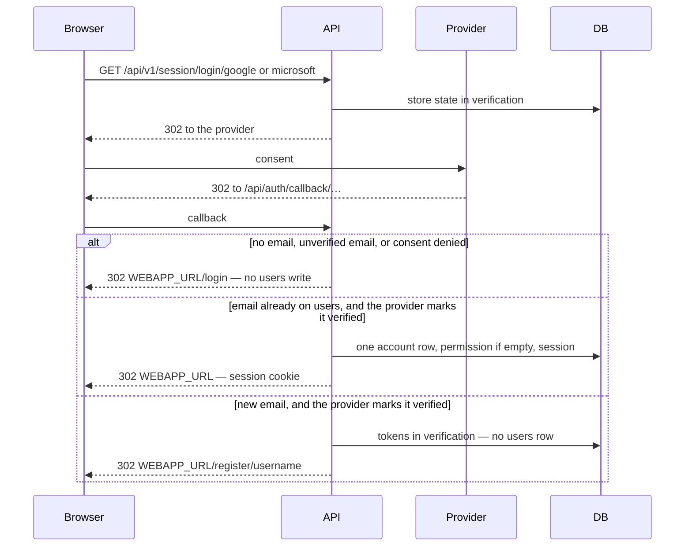
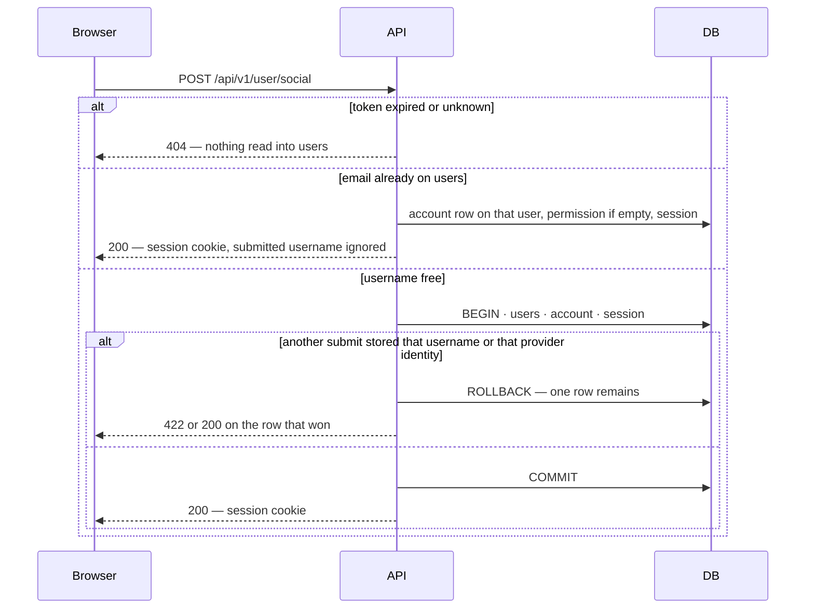

# Google and Microsoft sign-in

> Plan from this document. Each slice below carries its own shape — copy it, do not re-derive it.
> Status: confirmed by the user, 2026-09-27

## Situation

- Project: in active construction
- Decision: committed by the user, 2026-09-27, in this conversation. Social login was out of the authentication design confirmed 2026-09-26. This round is the next piece.
- In flight: the password session cookie, `users.permission`, and the activation link are the behavior this extends. Passkeys, two-factor, and new permission rules stay out.
- At stake: one-way. The redirect address registered at Google and at Microsoft has to match this API, and a verified email attaches to one `users` row. An abandoned username is cheap only while no `users` row was written.

## Problem

Sign-in without a password was not in the 2026-09-26 round. The user made it the next piece on 2026-09-27, so the login screen can offer Google and Microsoft before the next finance feature. Nothing in this API is blocked without it: password signup, the activation link, and the session cookie already work. There is no count of people waiting. The only accounts are test and localhost.

## Success

- Worked if: a new person who submits a username, and a person whose email already exists, both finish Google and both finish Microsoft with `permission` `["create:session:own"]` and the session cookie. A person who leaves before a username has no `users` row.
- Going wrong: the activation email is sent for a provider return, or a `users` row exists before a username.
- Review: whoever holds the Google and Microsoft consoles tries one real account on each, once.

## Boundary

In: Google and Microsoft as sign-in providers, the username step for a new person, linking a verified email to the existing `users` row, and the webapp screens that start and finish that trip.

Out: passkeys and two-factor — still deferred. New permission rules — the catalog stays as it is. Signing in with an ID token, One Tap, or a native mobile client. Linking a provider from a screen the person is already logged into. A hosted-domain or tenant limit. Storing the provider's photo. A password on an account that has no `credential` row — `PUT /api/v1/user/:username` still updates `account.password` only where `provider_id` is `credential`.

Unchanged: `POST /api/v1/user`, `PATCH /api/v1/user/activate`, `POST /api/v1/user/activate`, `POST /api/v1/session/login`, `DELETE /api/v1/session/logout`, `GET /api/v1/user`, and `PUT /api/v1/user/:username`. The session cookie name, the 30-day slide, and `SameSite=Strict`. `users.username` and `users.email` stay required and unique. The activation link for a password signup stays `WEBAPP_URL/register/activate?token=…`.

## Prior art

- The browser starts here, the provider redirects to a registered callback on this API, and this API sets the session — the shape in Better Auth's Google and Microsoft docs. We take it. The doc samples use `http://localhost:3000` and `BETTER_AUTH_URL`. This API's callback is `{BASE_URL}/api/auth/callback/…` and `baseURL` stays `BASE_URL`.
- Microsoft does not mark the email claim verified, and the claim is missing unless the app asks for it. A team that links on the raw claim attaches the wrong person. Key decision 4.
- The library callback writes `users` and the session before it redirects, and it refuses to attach a provider when `email_verified` is still false. We do not take that write for a new person, and we do not take that refusal. Key decisions 1 and 2.
- Google's and Microsoft's extra scopes, refresh-token forcing, and workspace `hd` limits are for products that call those APIs later. We sign in and stop.

## Shape

A verified provider return is an `account` row on the `users` row with that email. A new person is not a `users` row until they submit a username; until then the provider tokens sit in `verification` and the browser holds a 15-minute token. The door is the callback path registered in both consoles: changing it means new redirect URIs, and every return fails until they match. Letting the library write `users` on the callback wins only if an abandoned signup may leave a user row, and it may not.

## Key decisions

1. **A provider return that marks the email verified attaches to the existing `users` row with that email, including when `email_verified` is still false, and does not change `username`.** Empty `permission` becomes `["create:session:own"]`. `email_verified` becomes true. No activation email is sent. The library default refuses this attach when the local email is unverified. Do not copy that refusal.

2. **A new person gets no `users` row, no `account` row, and no session cookie until the username is accepted.** The provider tokens wait in `verification` for 15 minutes. The browser is sent to `WEBAPP_URL/register/username?token=…`. Closing that tab leaves no user. The next attempt starts at the provider again. The library callback writes `users` before it redirects. A new person must not take that write. The tokens do not go in the URL.

3. **The username submit stores `permission` `["create:session:own"]` on the new `users` row, writes one `account` row for that provider identity, and then sets the same session cookie as password login.** One `account` row per (`provider_id`, `account_id`). A lost race leaves one row. If that email was stored while they were choosing a username, the existing row wins, the submitted username is ignored, and the cookie is set.

4. **A return with no email, an email the provider does not mark verified, or a denied consent writes nothing on `users` and sets no cookie.** The browser is sent to `WEBAPP_URL/login`. Microsoft's email claim is not proof unless the token marks it verified. Do not treat the raw claim as proof. Do not create a second `users` row for that address.

5. **The browser starts at `GET /api/v1/session/login/google` and `GET /api/v1/session/login/microsoft`. The provider returns to `{BASE_URL}/api/auth/callback/google` and `{BASE_URL}/api/auth/callback/microsoft`.** Those two callback paths are the only library routes mounted. Password routes stay the ones already shipped. `baseURL` stays `BASE_URL`. Do not add `BETTER_AUTH_URL`.

6. **OAuth state stays in `verification`.** The session cookie stays `SameSite=Strict`. A state cookie is dropped on the return from the provider, and the callback then fails. This database already stores that state. Do not move it to a cookie.

7. **After the provider, the browser is sent only to `WEBAPP_URL`.** Any Google account. Microsoft accepts personal and work accounts. No hosted-domain limit. The provider image is not written to `users.image`.

## Work

| Slice                                    | Delivers                                                                                          | Status |
| ---------------------------------------- | ------------------------------------------------------------------------------------------------- | ------ |
| [Providers](#providers)                  | Google and Microsoft apps whose redirect URI is the callback in Key decision 5, and the four secrets | clear  |
| [Provider return](#provider-return)      | A verified email attached to the existing user, or a refusal with no user                        | clear  |
| [Username](#username)                    | A new `users` row only after a username, then the session cookie                                  | clear  |
| [Webapp](#webapp)                        | The two buttons, the username screen, and the login screen the refusal lands on                  | clear  |

Order: Providers → Provider return → Username. Webapp after those routes exist.

Already handled by existing code: password signup, the activation link, password login, logout, `GET /api/v1/user`, and a password change on a `credential` account. A duplicate `username` is 422, as `users` does today.

Derivable from the repository, left to the plan: error bodies, ISO dates, and never returning `password` — all as `users` does them. The 15-minute token uses the same lifetime as the activation link.

### Providers

**Delivers** a Google app and a Microsoft app that send the browser back to this API, and the secrets this API reads. **Status: clear.**

| State                                      | What exists                                                                                          |
| ------------------------------------------ | ---------------------------------------------------------------------------------------------------- |
| Local and production                       | Each environment's `{BASE_URL}/api/auth/callback/google` and `{BASE_URL}/api/auth/callback/microsoft` is an authorized redirect URI. Local `BASE_URL` is `http://localhost:8080`. |
| Google                                     | One web OAuth client. The client id and secret are `GOOGLE_CLIENT_ID` and `GOOGLE_CLIENT_SECRET`.   |
| Microsoft                                  | One app that accepts personal and work accounts. The client id and secret are `MICROSOFT_CLIENT_ID` and `MICROSOFT_CLIENT_SECRET`. The ID token is allowed to carry `email`. |
| Secrets                                    | The four values are in `.env.development`, `.env.prod`, and the CI `TEST_ENV` secret. They are not in git. |

A redirect URI copied from the Better Auth docs (`localhost:3000`, or a path other than `/api/auth/callback/…`) never reaches this API. Key decision 5.

### Provider return

**Delivers** the attach-or-refuse outcome for a browser that comes back from Google or Microsoft. **Status: clear.** This is the door.

| State                                      | What should happen                                                                                     | Caller sees                                      |
| ------------------------------------------ | ------------------------------------------------------------------------------------------------------ | ------------------------------------------------ |
| Email already on `users`, provider marks it verified | Attach. Keep `username`. Key decision 1. Set the session cookie.                                      | Browser lands on `WEBAPP_URL` with the cookie    |
| Email not on `users`, provider marks it verified     | No `users` row and no cookie. Tokens wait in `verification`. Key decision 2.                          | Browser lands on `WEBAPP_URL/register/username?token=…` |
| No email, email not marked verified, or consent denied | No `users` write and no cookie. Key decision 4.                                                      | Browser lands on `WEBAPP_URL/login`              |
| Same provider identity already attached    | A new session. `username` and `permission` stay as they are.                                           | Browser lands on `WEBAPP_URL` with the cookie    |

`GET /api/v1/session/login/google` → `302` to Google

`GET /api/v1/session/login/microsoft` → `302` to Microsoft

`account` gains one unique index. No new table. `verification` already exists and is where the tokens wait.

| Column        | Type | Null | References | Note                                                                 |
| ------------- | ---- | ---- | ---------- | -------------------------------------------------------------------- |
| `provider_id` | text | no   |            | Existing. `credential`, `google`, or `microsoft`. Part of the unique index. |
| `account_id`  | text | no   |            | Existing. The provider's own subject. Part of the unique index.      |

### Username

**Delivers** the `users` row and the session cookie for a person who was sent to the username screen. **Status: clear.**

| State                                      | What should happen                                                                 | Caller sees                          |
| ------------------------------------------ | ---------------------------------------------------------------------------------- | ------------------------------------ |
| New username, live token                   | `users` is stored with that username, the email from the token, and `permission` `["create:session:own"]`. One `account` row. Then the session cookie. Key decision 3. | 200 `{}` and `Set-Cookie`            |
| Username already used                      | No `users` row. The token stays valid.                                             | 422                                  |
| Email stored since the provider returned   | The existing `users` row wins. The submitted username is ignored. Key decision 3.  | 200 `{}` and `Set-Cookie`            |
| Expired or unknown token                   | Nothing is stored.                                                                 | 404                                  |
| Two submits of the same new username       | One `users` row and one `account` row. Key decision 3.                             | One 200. The other is 422 or 200 on the row that won. |

`POST /api/v1/user/social` `{ username, token }` → `200` `{}` and `Set-Cookie`

### Webapp

**Delivers** the screens that start the provider and collect a username. This repo does not contain them. **Status: clear.**

| State                         | What should happen                                                                                          | Caller sees                                      |
| ----------------------------- | ----------------------------------------------------------------------------------------------------------- | ------------------------------------------------ |
| Logged-out login screen       | Two controls. Each is a full navigation to `GET /api/v1/session/login/google` or `GET /api/v1/session/login/microsoft`. | The browser leaves for the provider              |
| `WEBAPP_URL/register/username?token=` | One username field. Submit sends `POST /api/v1/user/social`. A 422 stays on this screen and keeps the token. | After 200, the same landing as a password login  |
| `WEBAPP_URL/login` after a refusal | The login screen again. No session.                                                                        | The person can try a provider or the password    |
| `WEBAPP_URL` after a cookie   | The app calls `GET /api/v1/user` the way it does after password login.                                      | `permission` includes `create:session:own`       |

## Sources

- [docs/Roadmap/M2/M2I27/authentication.md](../M2I27/authentication.md) — password, session, and activation. Social login was out of that round. `baseURL` is `BASE_URL`.
- [docs/how-this-works/authentication-workflow.md](../../../how-this-works/authentication-workflow.md) — the routes this leaves unchanged. Local `BASE_URL` is `http://localhost:8080`.
- [Better Auth Google](https://www.better-auth.com/docs/authentication/google) — redirect URI is `{baseURL}/api/auth/callback/google`. The sample port is 3000.
- [Better Auth Microsoft](https://www.better-auth.com/docs/authentication/microsoft) — redirect URI is `{baseURL}/api/auth/callback/microsoft`. The email claim is not verified and is omitted unless the app requests it. Account id is the Entra `oid`.
- [Better Auth OAuth](https://www.better-auth.com/docs/concepts/oauth) — the callback writes the user before redirect. Implicit link requires a verified email, and by default also a locally verified email.
- [Better Auth users and accounts](https://www.better-auth.com/docs/concepts/users-accounts) — same-email attach is on unless implicit linking is disabled.
- Better Auth 1.7.6 in this repo — with a database configured, OAuth state is stored in `verification`, not in a cookie. `users.name` is this API's `username`.
